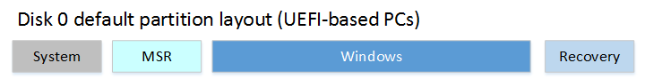

# Disk partition layout

Here is some information about why and how to create a suitable partition layout for installing modern Windows.

## UEFI and GPT

The [Unified Extensible Firmware Interface (UEFI)](https://en.wikipedia.org/wiki/UEFI) is the successor of the BIOS.
It is an open standard that defines how a computer boots before handing things over to an operating system.

This standard also defines (and supports) the [GUID Partition Table (GPT)](https://en.wikipedia.org/wiki/GUID_Partition_Table)
partitioning scheme, which is designed to relax some limitations of its predecessor, the Master Boot Record (MBR) – in 
particular, the limits on the number and size of disk partitions and increased.

## Windows Requirements

On modern machines, the drive containing Windows should use the GPT partition scheme, with the following partitions:



| Common name                        | Size requirements                                    | File system   | Type constant name             | Type ID                                | Description                                                                                                                                                                                                                                                                                                        |
|------------------------------------|------------------------------------------------------|---------------|--------------------------------|----------------------------------------|--------------------------------------------------------------------------------------------------------------------------------------------------------------------------------------------------------------------------------------------------------------------------------------------------------------------|
| EFI System Partition (ESP)         | &GreaterSlantEqual; 200 MB                           | FAT32         | `PARTITION_SYSTEM_GUID`        | `c12a7328-f81f-11d2-ba4b-00a0c93ec93b` | The boot partition. It is managed by Windows, and we shouldn't put files in it manually.                                                                                                                                                                                                                           |
| MicroSoft Reserved partition (MSR) | 16 MB exactly                                        | (unspecified) | `PARTITION_MSFT_RESERVED_GUID` | `e3c9e316-0b5c-4db8-817d-f92df00215ae` | Helps GPT with partition management. It's a reserved partition without ID. It cannot store user data.                                                                                                                                                                                                              |
| Windows partition                  | &GreaterSlantEqual; 20 GB                            | NTFS          | `PARTITION_BASIC_DATA_GUID`    | `ebd0a0a2-b9e5-4433-87c0-68b6b72699c7` | The partition where Windows is installed, which also contains user data. It must have at least 16GB of free space at the end of the initial setup (OOBE).                                                                                                                                                          |
| Recovery partition (for WinRE)     | ~1 GB = winre.wim (500-700MB) + 100-250MB free space | NTFS          | `PARTITION_MSFT_RECOVERY_GUID` | `de94bba4-06d1-4d40-a16a-bfd50179d6ac` | Contains the Windows Recovery Environment (WinRE), which contains recovery tools to repair or reset the system. It is recommended to place it **right after the Windows partition**, so the system can increase its size by shrinking the Windows partition in case of upgrade that requires more space for WinRE. |

Sources:
* the [official Windows UEFI requirements doc](https://learn.microsoft.com/en-us/windows-hardware/manufacture/desktop/configure-uefigpt-based-hard-drive-partitions?view=windows-11)
* the [official Windows API docs for partition GUIDs](https://learn.microsoft.com/en-us/windows/win32/api/winioctl/ns-winioctl-partition_information_gpt)
* the Recovery partition file system requirement is not directly specified, but Windows creates it as NTFS by default, and recovery tools expect NTFS features.

## Sample Diskpart script

Here is a typical Diskpart script to set up a disk meant for Windows 11, without extra data partitions:

```text
rem === 0. Start with a clean GPT disk ==============
select disk 0
clean
convert gpt

rem === 1. System partition =========================
create partition efi size=300
format quick fs=fat32 label="System"
assign letter="S"

rem === 2. Microsoft Reserved (MSR) partition =======
create partition msr size=16

rem === 3. Windows partition ========================
create partition primary 
rem Create space for the recovery tools at the end
shrink minimum=1024
format quick fs=ntfs label="Windows"
assign letter="W"

rem === 4. Recovery partition =======================
create partition primary
format quick fs=ntfs label="Recovery"
assign letter="R"
rem The official type GUID for the recovery partition
set id="de94bba4-06d1-4d40-a16a-bfd50179d6ac"
rem To hide the recovery partition from the user
gpt attributes=0x8000000000000001
```

Notes:
* letters are only meaningful during the WinPE (Windows Preinstallation Environment) phase, and are actually not 
  strictly required: Windows finds the partitions using their type GUID. The letters are useful if we need to refer to 
  the partitions somewhere else during the WinPE phase (e.g. in custom scripts).
* `create partition recovery` supposedly exists according to ChatGPT, but I have yet to find any docs about this
* Using `create partition primary id=...` seems cleaner than `create partition primary` + `set id=...` but:
  * it doesn't work on old Windows (not really a problem, since we're only interested in Win 11)
  * it apparently doesn't allow setting GPT attributes after the fact (to hide the recovery partition)